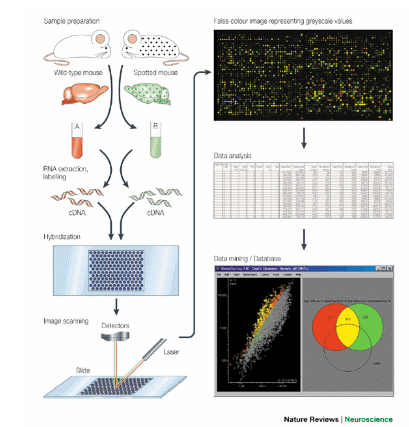
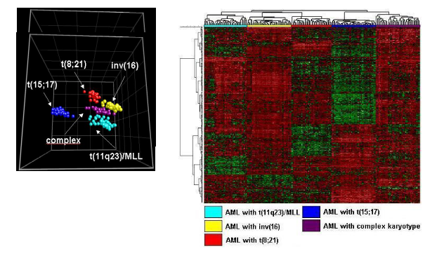
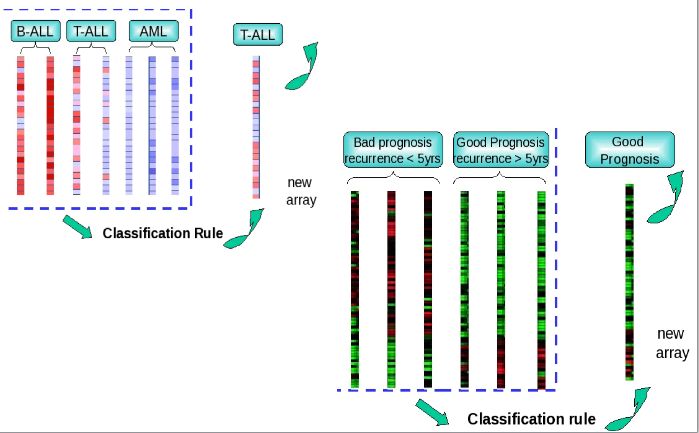
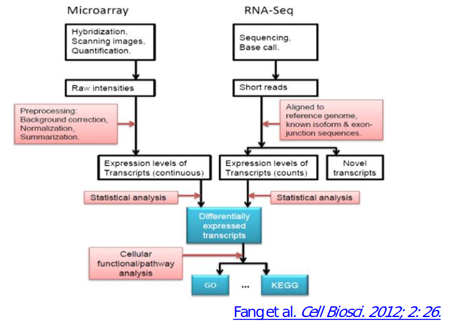
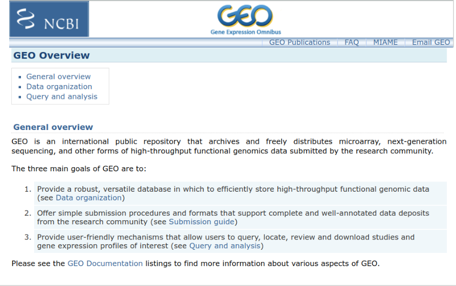
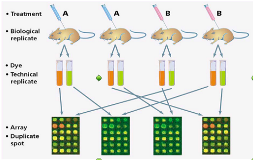

```{r setup, include=FALSE}
knitr::opts_chunk$set(echo = FALSE)
```


## Presentación

- Esta actividad enlaza con la anterior, en la que se introducen las tecnologías ómicas y los datos ómicos.
- Para ello se introduce  lo que denominamos el "proceso de análisis" señalando las características que son únicas de los datos ómicos frente a las que son comunes a otros tipos de estudios.

- En este vídeo veremos una perspectiva general de la actividad
  - Los objetivos y competencias a adquirir
  - Los contenidos del tema
  - Qué debates o ejercicios prácticos se realizaran
  - De qué recursos disponéis para llevarla a cabo.

## Antes de empezar: conocimientos previos

-   En esta unidad supondremos que ya os habéis familiarizado con las tecnologías ómicas, principalmente al análisis de microarrays con el que ilustramos los conceptos y métodos que se presentaran en esta primera parte.

-   Naturalmente también se asume que tenéis un dominio razonable de R y de los fundamentos de inferencia estadística al nivel que se imparten en el máster.

-   Si además os manejáis bien con Rmarkdown y habéis cursado la(as) asignaturas de Regresión y la de Análisis Multivariante, mejor que mejor.

## Objetivos y competencias

- Adquirir una visión general de lo que denominamos "Proceso de Análisis de Datos Ómicos", concretamente:
  - Conocer los tipos de estudios
  - Conocer las fuentes de datos y saber como obtenerlos
  - Conocer la herramientas básicas y saber como instalarlas.

- Adquirir un dominio básico de Bioconductor que permita obtener y explorar datos de microarrays desde el _Gene Expression Omnibus_
  
- Repasar conceptos de diseño de experimentos necesarios para una correcta planificación de estudios con datos ómicos

## Los contenidos en 5' (1a): Tipos de estudios

```{r, out.width = "75%", fig.align='center', echo=FALSE}

```

## Los contenidos en 5' (1b): Tipos de estudios


```{r, out.width = "90%", fig.align='center', echo=FALSE}

```

## Los contenidos en 5' (1c): Tipos de estudios


```{r, out.width = "90%", fig.align='center', echo=FALSE}

```


## Los contenidos en 5' (2): El proceso de Análisis

```{r, out.width = "90%", fig.align='center', echo=FALSE}

```

## Los contenidos en 5' (3): GEO

```{r, out.width = "90%", fig.align='center', echo=FALSE}

```

## Los contenidos en 5' (4): Bioconductor

```{r, out.width = "90%", fig.align='center', echo=FALSE}

```

## Los contenidos en 5' (5): Diseño de experimentos

```{r, out.width = "90%", fig.align='center', echo=FALSE}

```

## Caso de uso. Presentación


- El caso se basa en un estudio para estudiar la función del gen [ZBTB7B](http://www.genecards.org/cgi-bin/carddisp.pl?gene=ZBTB7B).

- Los autores  utilizaron microarrays para investigar en qué forma este gen regula la expresión de los genes de la grasa marrón en dos condiciones experimentales, temperatura ambiente y después de la exposición al frío.

- Tenéis acceso a los datos, el código y las explicaciones en el siguiente repositorio de GitHub: [https://github.com/ASPteaching/Omics_Data_Analysis-Case_Study_1-Microarrays](https://github.com/ASPteaching/Omics_Data_Analysis-Case_Study_1-Microarrays)
 

<!-- ## El experimento -->

<!-- Se realizó un experimento que comparó ratones de 10 semanas de edad con el gen desactivado ("KO" o noqueado) o no ("WT" o tipo salvaje) mantenidos durante cuatro horas a una de dos temperaturas diferentes, temperatura ambiente ("Room Temperature", RT) o después de la exposición al frío ("COLD", C). -->

<!-- El tamaño de la muestra para todo el experimento es de 12 muestras, tres réplicas de cada grupo. -->

<!-- Los microarrays utilizados para este experimento fueron del tipo Mouse Gene 2.1 de Affymetrix, ahora Thermofisher, uno de los proveedores más populares de tecnología de microarrays. -->

<!-- ## La pregunta a responder -->

<!-- En este estudio, queremos verificar el efecto de eliminar el gen regulador de la temperatura ("KO vs WT") y ver los efectos de esta eliminación en condiciones de temperatura ambiente o cuando la temperatura es inferior ("frio"). -->

<!-- ## El artículo y los datos -->

<!-- El estudio al que hace referencia este caso se encuentra publicado en el siguiente artículo: -->

<!-- Li, S., Mi, L., Yu, L., Yu, Q., Liu, T., Wang, G. X., Zhao, X. Y., Wu, J., & Lin, J. D. (2017). *Zbtb7b engages the long noncoding RNA Blnc1 to drive brown and beige fat development and thermogenesis*. Proceedings of the National Academy of Sciences of the United States of America, 114(34), E7111--E7120. -->

<!-- Los datos de los microarrays se han cargado para su posible revisión y reutilización en el repositorio "utilizados para este estudio se cargaron en el "Gene Expression Ominbus (GEO)". El identificador del estudio, que permite acceder a los dartos y otra información relevante es el [GSE100924](https://www.ncbi.nlm.nih.gov/geo/query/acc.cgi?acc=GSE100924). -->


## Materiales de estudio (1)

-   Esta actividad utiliza los capítulos 1 ("El proceso de Análisis") y 2 ("Análisis de Datos de Microarrays") del documento "Análisis de Datos de Microarrays".

-   Además se os proporcionaran materiales complementarios sobre 
    - github, 
    - bioconductor y 
    - diseño de experimentos.

- Naturalmente el caso de estudio, citado en la introducción, es un soporte más. 
    - Recordad, sin embargo, que un ejemplo _no es una guía rígida_ que seguir al pie de la letra.
    - Otros datasets u otros problemas requeriran cambios u omisiones del código.
    
## Materiales de estudio (2)

- La bioinformática evoluciona rápidamente, a la vez que la tecnología y los programas de análisis. Por este motivo los materiales contienen información que o bien queda ya obsoleta (los "PM/MM" en arrays de Affymetrix ya no se utilizan) o desactualizada (algunos fragmentos de código de R que han evolucionado con Bioconductor.)

-   El repositorio de github  [https://github.com/ASPteaching/Analisis_de_datos_omicos-Materiales_para_un_curso](https://github.com/ASPteaching/Analisis_de_datos_omicos-Materiales_para_un_curso) contiene un documento de trabajo que __actualiza los materiales docentes__
    - En una primera versión se trata básicamente del mismo documento con cambios mínimos, corrección de erratas y el código de R actualizado.
    - Podéis clonar el repositorio con Rstudio o acceder al documento directamente desde [este enlace](https://aspteaching.github.io/Analisis_de_datos_omicos-Materiales_para_un_curso/).

## Debates

- En esta actividad se realiza un debate que os permitirá poner en práctica los conceptos adquiridos y discutir las dudas que os surjan.

- Como en otros debates se busca promover la participación, y, para motivarla, ésta se evaluará (la media de los cuatro debates será el 10% en total de la calificación final).

- Para facilitar la evaluacuión _debéis compilar vuestras aportaciones en un documento que subiréis al Registro de Evaluación_.

