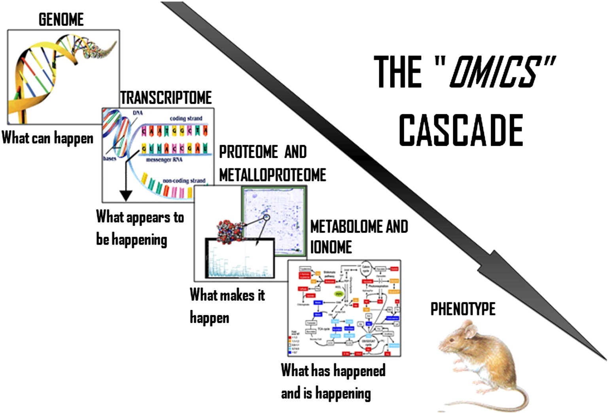
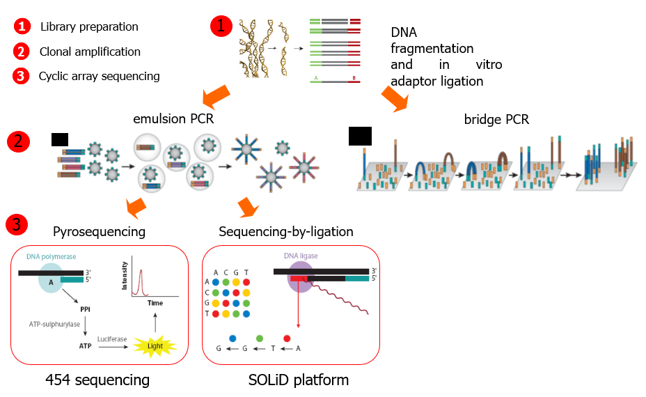

```{r setup, include=FALSE}
options(htmltools.dir.version = FALSE)
```

class: inverse, middle, center

# Outline

---

class: inverse, middle, center

# Introduction and Motivation

---

# Remember the _Omics Cascade_

.center[ 
 
 ] 

---

# From genome to infinity, and beyond

.pull-left[

- Assuming the Central Dogma and the Omics Cascade means <br>assuming that _knowing and understanding the genome sequence is key to understand life and disease_.

- Said otherwise. "If you want to study anything: sequence it!"

]

.pull-right[

 

]

---

# Genome sequencing

- Genome sequencing is _figuring out the order of DNA nucleotides, or bases, in a genome, the order of As, Cs, Gs, and Ts that make up an organism's DNA_.
- It has been developing for almost half century and has been thoroughly described [@Messi1998, @Kulski2016].
- Some hints:
```{r, echo=FALSE, message=FALSE}
m<- c("(1965)","Yeast tRNA sequenced", "1",
  "(1977-78)", "Sanger Dideoxy termination and Gilbert Chemical Degradation Methods", "1000","(1986)","Leroy Hood's Partial Automation","25.000",
  "(1992-95)","Craig Venter's first sequencing 'factory' at TIGR", "1000.000")
m<- matrix(m, nrow=4, byrow=TRUE)
colnames(m) <- c("Years", "Description", "Sequencing efficiency (bp/person/year")
```

```{r, echo=FALSE}
kableExtra::kable(m)
```

- Increased automation, without great changes in the fundamental ideas, led to the sequencing of the first genomes.

---


# The Human Genome Project

<p></p>
 
<p></p>
<p></p>

Follow [this link](http://exploreable.wordpress.com/2011/05/03/the-story-of-the-human-genome-project-a-short-narration/) to learn about the story of the Human Genome Project.

---

# The rise of Next Generation Sequencing

- The first Human Genome was sequenced using _Sanger Sequencing- and the _shotgun_ method.

- By mid of the first decade of XXI a new technology emerged.
- It was called _Next Generation Sequencing_ because it served the same purpose with a series characteristics that have made it revolutionary (again):

  - Parallelized,
  - High Throughput,
  - Cost-effective,
  - Many competing technologies.
  
- By 2020 it has become a standard but it has also kept evolving:
- "Next-Next" Generation sequencing

  - Single molecule (no amplification)
  - Long Reads
  


---
class: middle, center

# NGS: much more for much less


<p>
 

---

class: inverse, middle, center

# Overview of Sequencing Technologies

---

# Sanger Sequencing

.pull-left[
- The method is based on the selective incorporation of chain-terminating dideoxynucleotides by DNA polymerase during in vitro DNA replication.

- This results in multiple chains of different sizes ending with the same nucleotides, where the size indicates the nucleortide's position.

- Separating the chains using gel electrophoresis allows establishing the order.

[Follow this link](https://www.youtube.com/watch?v=FhlKYsc_9_A) to see an animation.

]

.pull-right[

 

]

---

# Sanger vs Next Generation Sequencing

.pull-left[

]

.pull-right[
 
]

---


# Sanger vs Next Generation Sequencing

.pull-left[

]

.pull-right[
 
]

---

# Sanger vs Next Generation Sequencing

.pull-left[

]

.pull-right[
 
]

---

# Sanger vs Next Generation Sequencing

.pull-left[

]

.pull-right[
 
]

---

# Sanger vs Next Generation Sequencing

.pull-left[

]

.pull-right[
 
]

---


# Next Generation Sequencing

.center[ 
 
]

--- 

# Next Generation Sequencing

.center[ 
 
]

--- 

# Next Generation Sequencing

 

--- 

# Next Generation Sequencing

 

--- 

# Next Generation Sequencing

 

--- 

# Next Generation Sequencing

 

--- 
