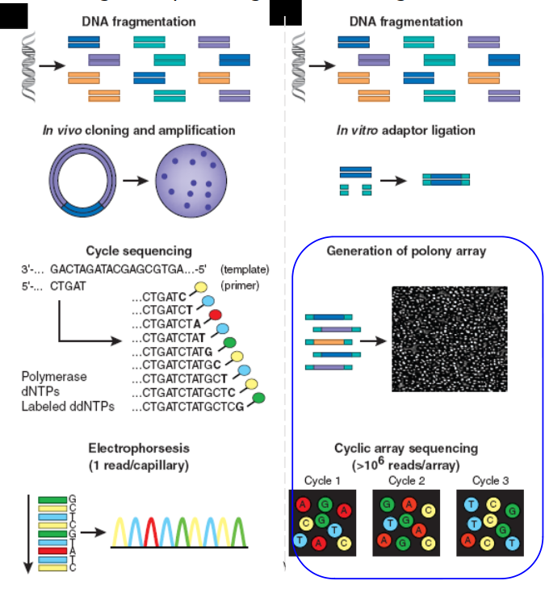

```{r setup, include=FALSE}
options(htmltools.dir.version = FALSE)
```

# ```{r, load_refs, include=FALSE, cache=FALSE}
# require(RefManageR)
# BibOptions(check.entries = FALSE,
#            bib.style = "authoryear",
#            cite.style = "alphabetic",
#            style = "markdown",
#            hyperlink = FALSE,
#            dashed = FALSE)
# ```
# 
# ```{r}
# myBib <- ReadBib("references.bib", check = FALSE)
# ```


# Outline

.columnwide[
  ### 1) [Introduction: DNA sequencing.](#Introduction)
  ### 2) [Overview of Sequencing Methods and Technologies.](#Overview)
  ### 3) [NGS Bioinformatics.](#Bioinformatics)
  ### 4) [Applications of NGS.](#Applications)
]

---

class: inverse, middle, center

name: Introduction

# Introduction and Motivation <a id="Introduction"></a>


---


# From the _Central Dogma_

.center[ 
 
 ] 

---
# Into the _Omics Cascade_

.center[ 
 
 ] 

---

# From genome to infinity, and beyond

.pull-left[

- Assuming the Central Dogma and the Omics Cascade means <br>assuming that _knowing and understanding the genome sequence is key to understand life and disease_.

- Said otherwise. "If you want to study anything: sequence it!"

]

.pull-right[

 

]

---

# Genome sequencing

- Genome sequencing is _figuring out the order of DNA nucleotides, or bases, in a genome, the order of As, Cs, Gs, and Ts that make up an organism's DNA_.
- It has been developing for almost half century and has been thoroughly described.  
- Some hints:
```{r, echo=FALSE, message=FALSE}
m<- c("1965","Yeast tRNA sequenced", "1",
  "1977-78", "Sanger Dideoxy termination and Gilbert Chemical Degradation Methods", "1000","1986","Leroy Hood's Partial Automation","25.000",
  "1992-95","Craig Venter's first sequencing 'factory' at TIGR", "1000.000")
m<- matrix(m, nrow=4, byrow=TRUE)
colnames(m) <- c("Year discov.", "Description", "Sequencing efficiency (bp/person/year")
```

```{r, echo=FALSE}
kableExtra::kable(m)
```

- Increased automation, without great changes in the fundamental ideas, led to the sequencing of the first genomes.

---

# The Human Genome Project

<p></p>
 
<p></p>
<p></p>

Follow [this link](http://exploreable.wordpress.com/2011/05/03/the-story-of-the-human-genome-project-a-short-narration/) to learn about the story of the Human Genome Project.

---

# The rise of Next Generation Sequencing

- The first Human Genome was sequenced using _Sanger Sequencing- and the _shotgun_ method.

- By mid of the first decade of XXI a new technology emerged.
- It was called _Next Generation Sequencing_ because it served the same purpose with a series characteristics that have made it revolutionary (again):

  - Parallelized,
  - High Throughput,
  - Cost-effective,
  - Many competing technologies.
  
- By 2020 it has become a standard but it has also kept evolving:
- "Next-Next" Generation sequencing

  - Single molecule (no amplification)
  - Long Reads
  


---
class: middle, center

# NGS: much more for much less


<p>
 

---

class: inverse, middle, center
name: Overview

# Overview of Sequencing Methods and Technologies

---

# Resources

- Sequencing is a dynamic process which is better visualized through animations.

- In order to help understand it and to promote its use many educational videos have been prepared by both companies and academics.

- Some interesting resources:

  - [Sequencing Fundamentals (15-min, Illumina)](https://support.illumina.com/content/dam/illumina-support/courses/sequencing-fundamentals/story_html5.html?iframe)
  - [Introduction to NGS, YouSeq](https://youseq.com/learning)
  - [Links-2-links, some may not work](https://www.k-state.edu/igenomics/workshops/IGF%20Self%20Education%20Links.pdf)

---

# Sanger Sequencing

.pull-left[
- The method is based on the selective incorporation of chain-terminating dideoxynucleotides by DNA polymerase during in vitro DNA replication.

- This results in multiple chains of different sizes ending with the same nucleotides, where the size indicates the nucleortide's position.

- Separating the chains using gel electrophoresis allows establishing the order.

[Follow this link](https://www.youtube.com/watch?v=FhlKYsc_9_A) to see an animation.

]

.pull-right[

 

]

---

# Sanger vs Next Generation Sequencing

.pull-left[
 
]

.pull-right[

- Next Generation Sequencing goes through the same steps as Sanger Sequencing, only it is done in more efficient ways.

- We consider two such steps:

  - Cloning
  
  - Sequencing

]
---


# Sanger vs Next Generation Sequencing

.pull-left[
 
]

.pull-right[

1) Construction of a sequencing library

  - Clonal amplification to generate sequencing features

]

---

# Sanger vs Next Generation Sequencing

.pull-left[
 
]

.pull-right[

1) Construction of a sequencing library

  - NGS: Clonal amplification to generate sequencing features
  - Sanger: In vivo cloning, transformation, colony picking...

]

---

# Sanger vs Next Generation Sequencing

.pull-left[
 
]

.pull-right[

1) Construction of a sequencing library
  - NGS: Clonal amplification to generate sequencing features
  - Sanger: In vivo cloning, transformation, colony picking...

2) Sequencing
  - NGS: Array-based sequencing
    - High degree of parallelism
]

---

# Sanger vs Next Generation Sequencing

.pull-left[
 
]

.pull-right[

1) Construction of a sequencing library
  - NGS: Clonal amplification to generate sequencing features
  - Sanger: In vivo cloning, transformation, colony picking...

2) Sequencing
  - NGS: 
      - Array-based sequencing
      - Higher degree of parallelism 
  - Sanger
      - Capillary-based sequencing
      - Low degree of parallelism
]

---

# Next Generation Sequencing

.center[ 
 
]

---

# Next Generation Sequencing

.center[ 
 
]

---

# Next Generation Sequencing

 

---

# Next Generation Sequencing

 

---

# Next Generation Sequencing

 

---

# Next Generation Sequencing

 

---

class: inverse, middle, center

# 2nd Generation Sequencing Technologies

---

# 2nd Generation Sequencing Technologies

 

---

# Small Sequencing Platforms

 

---

# Big Sequencing Platforms

 

---

# Next next generation Sequencing
.pull-left[
 
]
.pull-right[
- Next (2nd) generation sequencing improved yield considerably but
Some (amplification) steps steps cannot avoid a certain % of errors.
- 3rd («next next») generation sequencing avoids some steps which yields less % of errors
- Very promising but not fully adopted yet!

]
---

# Next next generation Sequencing

 

---

# Next next generation Sequencing

 

---

# Speed Variation by Technology

 

---

class: inverse, middle, center

name: Bioinformatics

# NGS Bioinformatics

---

# NGS Bioinformatics Challenges

<p><p>

- Need for large amount of CPU power
  - Informatics groups must manage computer clusters
  - Challenges in parallelizing existing software or redesign of algorithms to work in a parallel environment
  - Another level of software complexity and challenges to interoperability
- VERY large text files (~10 million lines long)
  - Can’t do ‘business as usual’ with familiar tools such as Perl/Python.
  - Impossible memory usage and execution time 
  - Impossible to browse for problems
- Need sequence Quality filtering

---

# Data Management Issues

<p><p>

- Raw data are large. How long should be kept?
- Processed data are manageable for most people
  - 20 million reads (50bp) ~1Gb
- More of an issue for a facility: HiSeq recommends 32 CPU cores, each with 4GB RAM
- Certain studies much more data intensive than other
  - Whole genome sequencing
    - A 30X coverage genome pair (tumor/normal)~500 GB
    - 50 genome pairs ~ 25 TB

---

# Which Software for NGS?

 


---

class: inverse, middle, center

name: Applications

# Applications of Next Generation Sequencing <a id="Applications"></a>

---

# References and Resources (1)

## Some interesting resources

  - [Sequencing Fundamentals (15-min, Illumina)](https://support.illumina.com/content/dam/illumina-support/courses/sequencing-fundamentals/story_html5.html?iframe)
  - [Introduction to NGS, YouSeq](https://youseq.com/learning)
  - [Links-2-links, some may not work](https://www.k-state.edu/igenomics/workshops/IGF%20Self%20Education%20Links.pdf)